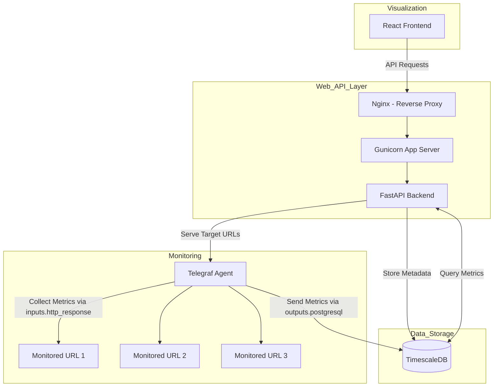

# URL Monitoring System

This is a URL monitoring system built with FastAPI, React, TimescaleDB, and Telegraf. It is designed to monitor thousands of URLs simultaneously with minimal performance impact.

## Project Architecture



## Components

*   **FastAPI Backend**: Provides the API endpoints for managing URLs, retrieving monitoring data, and configuring the system.
*   **React Frontend**: Provides a dynamic user interface for user registration, login, URL management, and visualization of monitoring data. It is built with React and uses token-based authentication (JWT) to interact securely with the backend API. The frontend is containerized using Docker and served by Nginx. For more details on the frontend architecture, setup, and development, see the [Frontend README](./frontend/README.md).
*   **TimescaleDB**: Stores the time-series data for the monitored URLs.
*   **Telegraf**: Collects the monitoring data from the URLs.
*   **Docker**: Containerizes the application for easy deployment.
*   **Docker Compose**: Orchestrates the different services of the application.
*   **bcrypt**: Used for securely hashing user passwords.
*   **Structlog**: Used for structured and configurable application logging.

## Getting Started

1.  **Prerequisites**: Ensure you have Docker and Docker Compose installed.
2.  **Clone Repository**: `git clone <repository-url>`
3.  **Environment Setup**:
    *   Copy the `.env.template` file to `.env`: `cp .env.template .env` (or use `copy` on Windows).
    *   **Generate JWT Secret Key**: Run `openssl rand -hex 32` or use a similar tool to generate a secure random string.
        ```bash
        docker-compose exec url-backend python -c "import secrets; print(secrets.token_hex(32))"
        ```
    *   **Update `.env`**: Open the `.env` file and set the `JWT_SECRET_KEY` variable to the generated key. You can also adjust database credentials if needed.
4.  **Build and Start Services**:
    * **Build Docker Images**:
      ```bash
      docker-compose -f docker-compose.template.yml build
      ```
    * **Start Service**:
      ```bash
      docker-compose -f docker-compose.template.yml up
      ```
      ```bash
      docker-compose -f docker-compose.template.yml up -d
      ```
    * **Start Service**:
      ```bash
      docker-compose -f docker-compose.template.yml down
      ```
    * **All-In-One**: This will build the images and start the database, backend, and other services in the background.
      ```bash
      docker-compose -f docker-compose.template.yml up --build -d
      ```
5.  **Apply Database Migrations**:
    Database schema migrations are now managed by Alembic and must be applied manually using the command line after the database service is running.
    ```bash
    docker-compose exec url-backend alembic upgrade head
    ```
    Run this command initially to set up the schema and whenever new migrations are added.
6.  **Create Super Admin**: Once the database schema is up to date and services are running, execute the super admin creation script. You will be prompted for a username, email, and password:
    ```bash
    docker-compose exec -it url-backend python -m utils.create_super_admin
    ```
7.  **Access Application**:
    *   The FastAPI backend should be available (e.g., at `http://localhost:8000` or as configured). Check the `/docs` endpoint for API documentation.
    *   The React Frontend should be accessible at `http://localhost:3000`.
    *   The pgAdmin interface (if configured) should be accessible (e.g., at `http://localhost:5050`).

## Authentication

*   Authentication is handled using a custom JSON Web Tokens (JWT) implementation, providing fine-grained control over token generation, validation, and security features.
*   Users log in via the `/auth/login` endpoint using their email and password (sent as form data: `username`=email, `password`=password).
*   Upon successful login, an `access_token` and a `refresh_token` are returned.
*   The `access_token` is required for accessing protected endpoints and is sent in the `Authorization: Bearer <token>` header.
*   Access tokens have different expiration times based on user roles:
    *   **Admin**: Short expiration (default: 15 minutes).
    *   **Viewer**: Longer expiration (default: 120 minutes).
    *   Expiration times can be configured via environment variables (`ADMIN_ACCESS_TOKEN_EXPIRES_MINUTES`, `VIEWER_ACCESS_TOKEN_EXPIRES_MINUTES`).
*   The `/auth/refresh` endpoint can be used with a valid `refresh_token` to obtain a new `access_token`.
*   A secure logout is implemented via the `/auth/logout` endpoint, which requires the refresh token to be sent in the request body. Upon logout, both the current access token and the provided refresh token are blacklisted to prevent their further use.
*   The system uses a token blacklist to keep track of invalidated tokens. When refreshing tokens, the blacklist is checked to ensure revoked refresh tokens cannot be used.
*   The JWT secret key is configured via the `JWT_SECRET_KEY` environment variable in the `.env` file. **It is crucial to set a strong, unique key for production.**
*   For a detailed visualization of these authentication flows, including token validation, blacklisting, and role-based access control, please see the [Authentication Flow Diagram](flow_diagrams/auth_flow.md).

## Database Migration Management

Database schema changes are managed using [Alembic](https://alembic.sqlalchemy.org/), a lightweight database migration tool for Python. This provides robust version control for your database schema, allowing for iterative changes and a clear history.

### Key Concepts:

*   **Alembic Environment**: Configuration is stored in `alembic.ini` and the `alembic/` directory. The `alembic/env.py` script is configured to work with `asyncpg` and uses settings from `backend/config/settings.py` to connect to the database.
*   **Migration Scripts**: Each schema change is represented by a revision script in the `alembic/versions/` directory. These are Python files containing `upgrade()` and `downgrade()` functions that use Alembic's `op.execute()` to run raw SQL statements. This allows for full use of TimescaleDB-specific features.
*   **CLI-Driven**: Migrations are no longer run automatically at application startup. They must be applied manually via the Alembic CLI.

### Common Commands:

These commands are typically run via `docker-compose exec url-backend alembic <command>` (assuming `url-backend` is your backend service name in `docker-compose.yml`):

*   **View History**: See all migration revisions and the current revision.
    ```bash
    docker-compose exec url-backend alembic history
    ```
*   **Check Current Revision**: Show the current database revision.
    ```bash
    docker-compose exec url-backend alembic current
    ```
*   **Create a New Revision**: Generate a new empty revision file. You will then edit this file to add your SQL changes.
    ```bash
    docker-compose exec url-backend alembic revision -m "describe_your_change_here"
    ```
*   **Upgrade to Latest Revision**: Apply all pending migrations.
    ```bash
    docker-compose exec url-backend alembic upgrade head
    ```
*   **Upgrade to a Specific Revision**:
    ```bash
    docker-compose exec url-backend alembic upgrade <revision_id>
    ```
*   **Downgrade by One Step**: Revert the last applied migration.
    ```bash
    docker-compose exec url-backend alembic downgrade -1
    ```
*   **Downgrade to a Specific Revision**:
    ```bash
    docker-compose exec url-backend alembic downgrade <revision_id>
    ```
*   **Stamp a Revision**: Mark a revision as applied without actually running the SQL (useful for initial setup or baseline).
    ```bash
    docker-compose exec url-backend alembic stamp head
    ```

## Backend Architecture Highlights

The backend is designed with modularity and maintainability in mind:

*   **Centralized Configuration (`backend/config/`)**: Key aspects like application settings (`settings.py`), database connections (`database.py`), logging (`logging.py` with Structlog), API routing (`routes.py`), and application lifespan events (`lifespan.py`) are managed centrally.
*   **Modular Applications (`backend/apps/`)**: Features are organized into distinct applications (e.g., `auth`), each typically containing its own routes, services, and schemas.
*   **Lean Entry Point (`backend/main.py`)**: The main application file is kept minimal, primarily responsible for instantiating the FastAPI application and including configurations.
*   **Dependency Injection**: FastAPI's dependency injection is used for managing dependencies like database connections, security checks, and service access.
