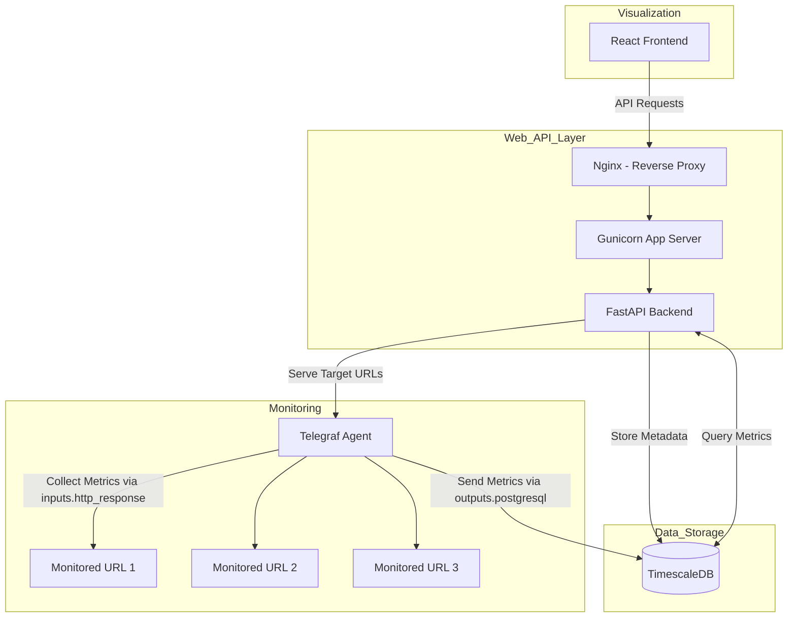
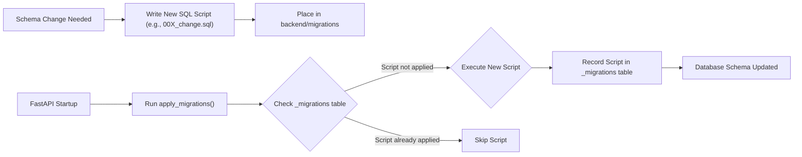

# URL Monitoring System

This is a URL monitoring system built with FastAPI, React, TimescaleDB, and Telegraf. It is designed to monitor thousands of URLs simultaneously with minimal performance impact.

## Project Architecture



## Components

*   **FastAPI Backend**: Provides the API endpoints for managing URLs, retrieving monitoring data, and configuring the system.
*   **React Frontend**: Provides a user interface for visualizing the monitoring data and managing the system.
*   **TimescaleDB**: Stores the time-series data for the monitored URLs.
*   **Telegraf**: Collects the monitoring data from the URLs.
*   **Docker**: Containerizes the application for easy deployment.
*   **Docker Compose**: Orchestrates the different services of the application.
*   **bcrypt**: Used for securely hashing user passwords.
*   **fastapi-jwt-auth**: Handles JWT token generation and verification for authentication.

## Getting Started

1.  **Prerequisites**: Ensure you have Docker and Docker Compose installed.
2.  **Clone Repository**: `git clone <repository-url>`
3.  **Environment Setup**:
    *   Copy the `.env.template` file to `.env`: `cp .env.template .env` (or use `copy` on Windows).
    *   **Generate JWT Secret Key**: Run `openssl rand -hex 32` or use a similar tool to generate a secure random string.
        ```bash
        docker-compose exec url-backend python -c "import secrets; print(secrets.token_hex(32))"
        ```
    *   **Update `.env`**: Open the `.env` file and set the `JWT_SECRET_KEY` variable to the generated key. You can also adjust database credentials if needed.
4.  **Build and Start Services**: Run `docker-compose up --build -d`. This will build the images and start the database, backend, and other services in the background.
5.  **Create Super Admin**: Once the services are running, execute the super admin creation script. You will be prompted for a username, email, and password:
    ```bash
    docker-compose exec -it url-backend python -m utils.create_super_admin
    ```
6.  **Access Application**:
    *   The FastAPI backend should be available (e.g., at `http://localhost:8000` or as configured). Check the `/docs` endpoint for API documentation.
    *   The pgAdmin interface (if configured) should be accessible (e.g., at `http://localhost:5050`).

## Authentication

*   Authentication is handled using a custom JSON Web Tokens (JWT) implementation, providing fine-grained control over token generation, validation, and security features.
*   Users log in via the `/auth/login` endpoint using their email and password (sent as form data: `username`=email, `password`=password).
*   Upon successful login, an `access_token` and a `refresh_token` are returned.
*   The `access_token` is required for accessing protected endpoints and is sent in the `Authorization: Bearer <token>` header.
*   Access tokens have different expiration times based on user roles:
    *   **Admin**: Short expiration (default: 15 minutes).
    *   **Viewer**: Longer expiration (default: 120 minutes).
    *   Expiration times can be configured via environment variables (`ADMIN_ACCESS_TOKEN_EXPIRES_MINUTES`, `VIEWER_ACCESS_TOKEN_EXPIRES_MINUTES`).
*   The `/auth/refresh` endpoint can be used with a valid `refresh_token` to obtain a new `access_token`.
*   A secure logout is implemented via the `/auth/logout` endpoint, which requires the refresh token to be sent in the request body. Upon logout, both the current access token and the provided refresh token are blacklisted to prevent their further use.
*   The system uses a token blacklist to keep track of invalidated tokens. When refreshing tokens, the blacklist is checked to ensure revoked refresh tokens cannot be used.
*   The JWT secret key is configured via the `JWT_SECRET_KEY` environment variable in the `.env` file. **It is crucial to set a strong, unique key for production.**
*   For a detailed visualization of these authentication flows, including token validation, blacklisting, and role-based access control, please see the [Authentication Flow Diagram](flow_diagrams/auth_flow.md).

## Database Migration Management Architecture
Database schema changes are managed via SQL scripts placed in the `backend/migrations` directory.

*   Scripts are named sequentially (e.g., `001_create_table.sql`, `002_add_column.sql`).
*   A custom script (`backend/utils/db_migrations.py`) runs automatically when the FastAPI application starts (`@app.on_event("startup")`).
*   This script connects to the database, checks a `_migrations` table for already applied scripts, and executes any new scripts found in the `backend/migrations` folder in alphabetical order.
*   Successfully executed script names are recorded in the `_migrations` table to prevent re-execution.



## Build and Deployment

1. **Build Docker Images**:
  ```bash
   docker-compose -f docker-compose.template.yml build
  ```
2. **Start Service**:
  ```bash
  docker-compose -f docker-compose.template.yml up -d
  ```
3. **Start Service**:
  ```bash
  docker-compose -f docker-compose.template.yml down
  ```