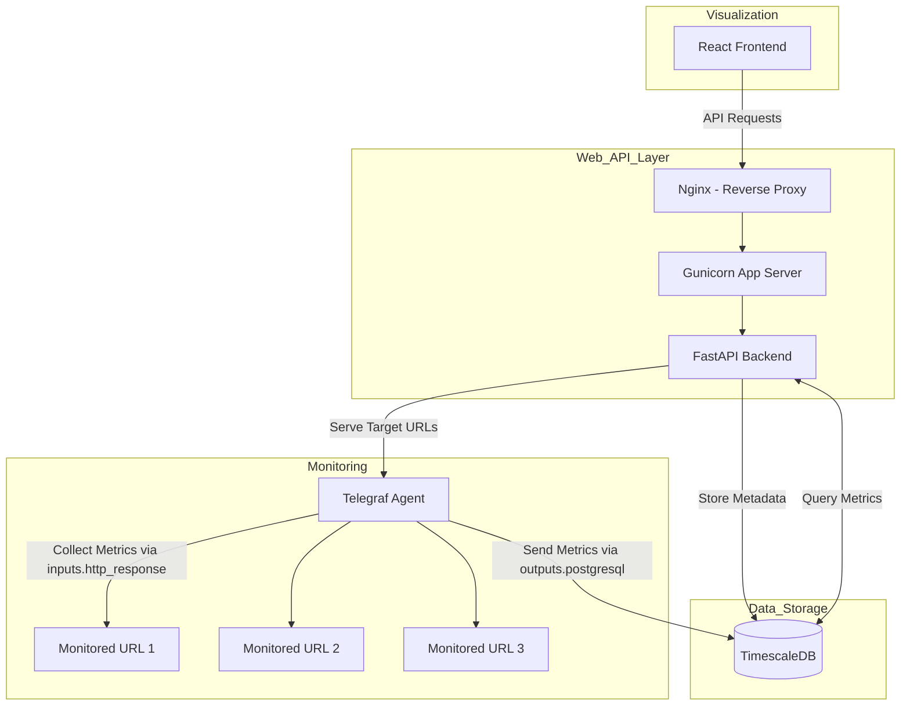

# URL Monitoring System

This is a URL monitoring system built with FastAPI, React, TimescaleDB, and Telegraf. It is designed to monitor thousands of URLs simultaneously with minimal performance impact.

## Project Architecture



## Components

*   **FastAPI Backend**: Powers the application's API, handling business logic, data processing, and user authentication. For detailed information on its architecture, setup, and management commands, see the [Backend README](./backend/README.md).
*   **React Frontend**: Provides a dynamic user interface for user registration, login, URL management, and visualization of monitoring data. It is built with React and uses token-based authentication (JWT) to interact securely with the backend API. The frontend is containerized using Docker and served by Nginx. For more details on the frontend architecture, setup, and development, see the [Frontend README](./frontend/README.md).
*   **TimescaleDB**: Stores the time-series data for the monitored URLs.
*   **Telegraf**: Collects the monitoring data from the URLs.
*   **Docker**: Containerizes the application for easy deployment.
*   **Docker Compose**: Orchestrates the different services of the application.
*   **bcrypt**: Used for securely hashing user passwords.
*   **Structlog**: Used for structured and configurable application logging.

## Getting Started

1.  **Prerequisites**: Ensure you have Docker and Docker Compose installed.
2.  **Clone Repository**: `git clone <repository-url>`
3.  **Environment Setup**:
    *   Copy the `.env.template` file to `.env`: `cp .env.template .env` (or use `copy` on Windows).
    *   **Generate JWT Secret Key**: Run `openssl rand -hex 32` or use a similar tool to generate a secure random string.
        ```bash
        docker-compose exec url-backend python -c "import secrets; print(secrets.token_hex(32))"
        ```
    *   **Update `.env`**: Open the `.env` file and set the `JWT_SECRET_KEY` variable to the generated key. You can also adjust database credentials if needed.
4.  **Build and Start Services**:
    * **Build Docker Images**:
      ```bash
      docker-compose -f docker-compose.template.yml build
      ```
    * **Start Service**:
      ```bash
      docker-compose -f docker-compose.template.yml up
      ```
      ```bash
      docker-compose -f docker-compose.template.yml up -d
      ```
    * **Start Service**:
      ```bash
      docker-compose -f docker-compose.template.yml down
      ```
    * **All-In-One**: This will build the images and start the database, backend, and other services in the background.
      ```bash
      docker-compose -f docker-compose.template.yml up --build -d
      ```
5.  **Apply Database Migrations**:
    Database schema migrations are now managed by Alembic and must be applied manually using the command line after the database service is running.
    ```bash
    docker-compose exec url-backend alembic upgrade head
    ```
    Run this command initially to set up the schema and whenever new migrations are added.
6.  **Create Super Admin**: Once the database schema is up to date and services are running, execute the super admin creation script. You will be prompted for a username, email, and password:
    ```bash
    docker-compose exec -it url-backend python backend/utils/create_super_admin.py create
    ```
7.  **Access Application**:
    *   The FastAPI backend should be available (e.g., at `http://localhost:8000` or as configured). Check the `/docs` endpoint for API documentation.
    *   The React Frontend should be accessible at `http://localhost:3000`.
    *   The pgAdmin interface (if configured) should be accessible (e.g., at `http://localhost:5050`).

## Authentication

The application uses JSON Web Tokens (JWT) for secure authentication. This system includes features like access and refresh tokens, role-based token expiry, token refresh mechanisms, and secure logout with token blacklisting.

For a detailed explanation of the authentication mechanisms, token handling, security configurations, and an overview of the authentication flow, please refer to the [Authentication section in the Backend README](./backend/README.md#authentication) and the [Authentication Flow Diagram](./flow_diagrams/auth_flow.md).

## Database Migration Management

Database schema changes are managed using [Alembic](https://alembic.sqlalchemy.org/), a lightweight database migration tool for Python, providing robust version control for your database schema.

Migrations are run via Docker Compose, executing Alembic commands within the backend service container. For detailed instructions on creating new revisions, applying migrations, and a list of common Alembic commands, please see the [Database Migrations section in the Backend README](./backend/README.md#database-migrations).
