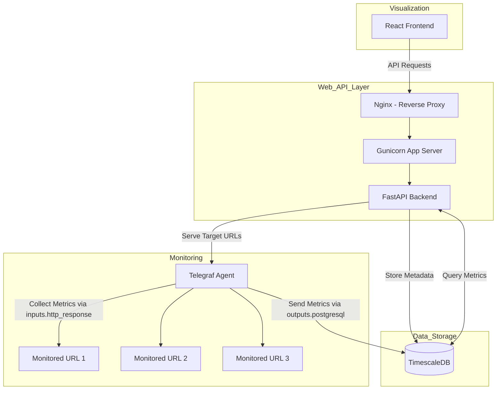

# URL Monitoring System

This is a URL monitoring system built with FastAPI, React, TimescaleDB, and Telegraf. It is designed to monitor thousands of URLs simultaneously with minimal performance impact.

## Architecture

## Components

*   **FastAPI Backend**: Provides the API endpoints for managing URLs, retrieving monitoring data, and configuring the system.
*   **React Frontend**: Provides a user interface for visualizing the monitoring data and managing the system.
*   **TimescaleDB**: Stores the time-series data for the monitored URLs.
*   **Telegraf**: Collects the monitoring data from the URLs.
*   **Docker**: Containerizes the application for easy deployment.
*   **Docker Compose**: Orchestrates the different services of the application.

## Getting Started

1.  Install Docker and Docker Compose.
2.  Clone the repository.
3.  Run `docker-compose up --build` to start the application.
