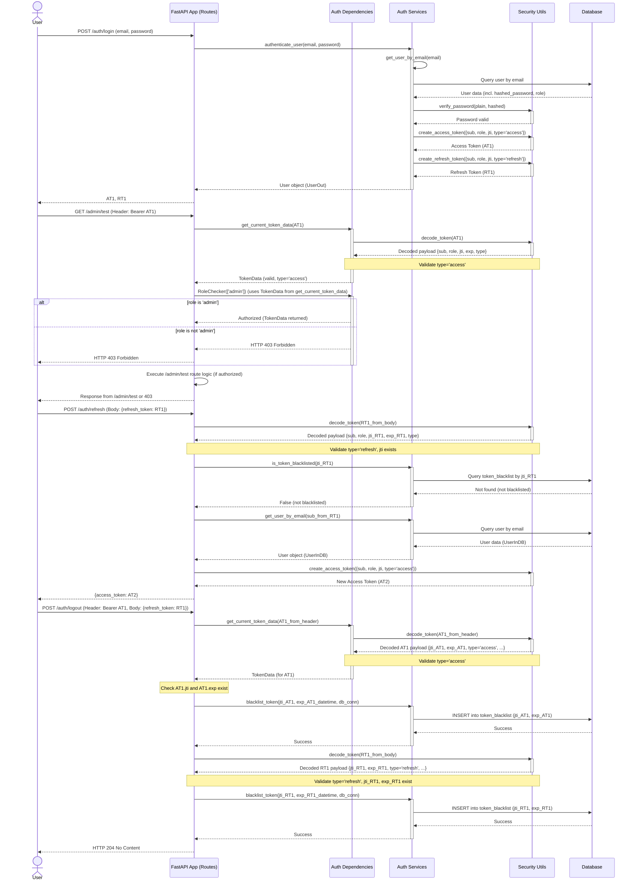

# Authentication and Authorization Flow

This diagram illustrates the key authentication and authorization flows within the application.

```mermaid
sequenceDiagram
    actor User
    participant App as FastAPI App (Routes)
    participant Deps as Auth Dependencies
    participant Services as Auth Services
    participant Security as Security Utils
    participant DB as Database

    %% --- Login Flow ---
    User->>App: POST /auth/login (email, password)
    App->>Services: authenticate_user(email, password)
    activate Services
    Services->>Services: get_user_by_email(email)
    Services->>DB: Query user by email
    DB-->>Services: User data (incl. hashed_password, role)
    Services->>Security: verify_password(plain, hashed)
    activate Security
    Security-->>Services: Password valid
    deactivate Security
    Services->>Security: create_access_token({sub, role, jti, type='access'})
    activate Security
    Security-->>Services: Access Token (AT1)
    deactivate Security
    Services->>Security: create_refresh_token({sub, role, jti, type='refresh'})
    activate Security
    Security-->>Services: Refresh Token (RT1)
    deactivate Security
    Services-->>App: User object (UserOut)
    deactivate Services
    App-->>User: AT1, RT1

    %% --- Accessing Protected Route (Admin Only Example) ---
    User->>App: GET /admin/test (Header: Bearer AT1)
    App->>Deps: get_current_token_data(AT1)
    activate Deps
    Deps->>Security: decode_token(AT1)
    activate Security
    Security-->>Deps: Decoded payload {sub, role, jti, exp, type}
    deactivate Security
    Note over Deps,Security: Validate type='access'
    Deps-->>App: TokenData (valid, type='access')
    deactivate Deps

    App->>Deps: RoleChecker(['admin']) (uses TokenData from get_current_token_data)
    activate Deps
    alt role is 'admin'
        Deps-->>App: Authorized (TokenData returned)
    else role is not 'admin'
        Deps-->>App: HTTP 403 Forbidden
        App-->>User: HTTP 403 Forbidden
    end
    deactivate Deps

    App->>App: Execute /admin/test route logic (if authorized)
    App-->>User: Response from /admin/test or 403

    %% --- Token Refresh Flow ---
    User->>App: POST /auth/refresh (Body: {refresh_token: RT1})
    App->>Security: decode_token(RT1_from_body)
    activate Security
    Security-->>App: Decoded payload {sub, role, jti_RT1, exp_RT1, type}
    deactivate Security

    Note over App,Security: Validate type='refresh', jti exists
    App->>Services: is_token_blacklisted(jti_RT1)
    activate Services
    Services->>DB: Query token_blacklist by jti_RT1
    DB-->>Services: Not found (not blacklisted)
    Services-->>App: False (not blacklisted)
    deactivate Services

    App->>Services: get_user_by_email(sub_from_RT1)
    activate Services
    Services->>DB: Query user by email
    DB-->>Services: User data (UserInDB)
    Services-->>App: User object (UserInDB)
    deactivate Services

    App->>Security: create_access_token({sub, role, jti, type='access'})
    activate Security
    Security-->>App: New Access Token (AT2)
    deactivate Security
    App-->>User: {access_token: AT2}

    %% --- Logout Flow ---
    User->>App: POST /auth/logout (Header: Bearer AT1, Body: {refresh_token: RT1})
    App->>Deps: get_current_token_data(AT1_from_header)
    activate Deps
    Deps->>Security: decode_token(AT1_from_header)
    activate Security
    Security-->>Deps: Decoded AT1 payload {jti_AT1, exp_AT1, type='access', ...}
    deactivate Security
    Note over Deps,Security: Validate type='access'
    Deps-->>App: TokenData (for AT1)
    deactivate Deps

    Note over App: Check AT1.jti and AT1.exp exist
    App->>Services: blacklist_token(jti_AT1, exp_AT1_datetime, db_conn)
    activate Services
    Services->>DB: INSERT into token_blacklist (jti_AT1, exp_AT1)
    DB-->>Services: Success
    Services-->>App: Success
    deactivate Services

    App->>Security: decode_token(RT1_from_body)
    activate Security
    Security-->>App: Decoded RT1 payload {jti_RT1, exp_RT1, type='refresh', ...}
    deactivate Security

    Note over App,Security: Validate type='refresh', jti_RT1, exp_RT1 exist
    App->>Services: blacklist_token(jti_RT1, exp_RT1_datetime, db_conn)
    activate Services
    Services->>DB: INSERT into token_blacklist (jti_RT1, exp_RT1)
    DB-->>Services: Success
    Services-->>App: Success
    deactivate Services

    App-->>User: HTTP 204 No Content
```
